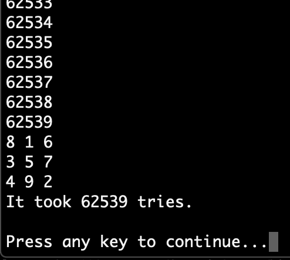
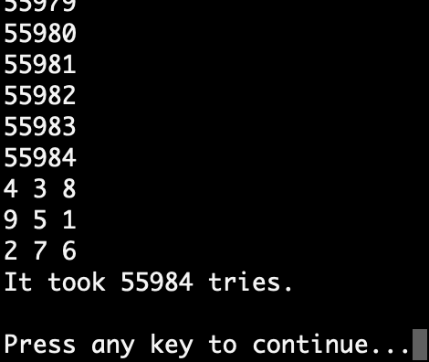

# Lo Shu Magic Square

## Instructions
This is a game for the Console simulating the moves needed to solve the game Tower of Hanoi.

Open the program in Visual Studio and click play. With brute force, randomly switching two numbers until amagic square board is formed, that is a board where the sum of the numbers is the same in all directions. Finally presenting one of the solutions and showing the number of tries it took.

The starting point is a 3 x 3 grid with the numbers 1 - 9:

1     2     3

4     5     6

7     8     9

The target is to find one of the eight possible solutions that have the same sum in all directions: horizontal, vertical and diagonal.

The eight possible solutions are:

8 1 6
3 5 7
4 9 2

6 1 8
7 5 3
2 9 4

4 9 2
3 5 7
8 1 6

2 9 4
7 5 3
6 1 8

8 3 4
1 5 9
6 7 2

4 3 8
9 5 1
2 7 6

6 7 2
1 5 9
8 3 4

2 7 6
9 5 1
4 3 8

## Screenshots

Here are two example screenshots with the result of the game, where the sixth solution above was found in 55984 tries and then the first solution found in 62539 tries.

## Built with
The project is built in Visual Studio, as a .NET Console Project, with C# as programming language

## Author
* Albert Stjärne (https://github.com/AlbertStjarne)
